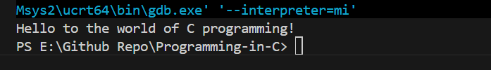

#Introduction

C language is the Higher level Language. C was developed by Dennis Ritchie at Bell Lab in 1970. It was named 'C' becase it's features were derived from the eraly language 'B'(BASIC). Initially it was designed for System Software later it's is used for portable application software

Refer First_C_Program.c file

#include <stdio.h>

This the preprocessor command. This contains build-in function, by including this file we can access that functions. Standard input output header includes the reading values form the keyboard and printing characters in screen. So that we can get inputs from the user and print the finaly output in display.

Final output looks like this 

#Compiling and executing C file

Hello to the world of C programming!

Let see how this output is achieved in my windows system. 

I wrote a C program named First_C_Program.c, If you see carfully this file extention is .c which means C language file which is human readable...which definetely machine can't read and execute this file. Thus this file should convert to machine readable language, so Compiler comes into picture.

Compiler is a tool which convert high level C program into machine readable object file. But with this object file alone is not enough to run into my windows system. Thus now Linker comes into picture 

This linker will link my object file and library file stdio together and gives executable file...which is run by my windows machine

